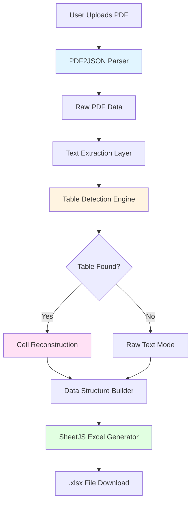

# PDF to Excel Conversion - Architecture Plan

## Overview
Add client-side PDF to Excel conversion functionality to the existing PDF Tools Suite, integrated under the "Convert" module alongside PDF to PPT conversion.

## Design Philosophy
- **Privacy-first**: 100% client-side processing, no server uploads
- **Best effort approach**: Optimize for accuracy while acknowledging limitations
- **User transparency**: Clear disclaimers about capabilities and limitations
- **Modular architecture**: Follow existing code patterns

## Architecture Diagram



## Module Structure

```
js/modules/excel.js          # Main Excel conversion module
js/utils/tableDetector.js    # Table detection algorithms
js/utils/cellReconstructor.js # Cell reconstruction logic
js/utils/excelUtils.js       # Excel-specific utilities
```

## Technical Stack

### Core Libraries
- **pdf2json** (v1.2.0): PDF parsing and text extraction
  ```html
  <script src="https://cdn.jsdelivr.net/npm/pdf2json@1.2.0/pdf.parser.js"></script>
  ```

- **SheetJS/xlsx** (latest): Excel file generation
  ```html
  <script src="https://cdn.sheetjs.com/xlsx-latest/package/dist/xlsx.full.min.js"></script>
  ```

### Why These Libraries?

| Library | Purpose | Client-Side | CDN Available |
|---------|---------|-------------|---------------|
| pdf2json | Structured PDF data extraction | ✅ | ✅ |
| SheetJS | Excel (.xlsx) generation | ✅ | ✅ |

## Implementation Components

### 1. PDF Text Extraction Layer

**Purpose**: Extract structured text data from PDF

**Algorithm**:
```javascript
async function extractPdfData(file) {
    const pdfParser = new PDFParser();
    await pdfParser.parsePDF(file);
    
    return {
        pages: pdfParser.formImage.Pages,
        textItems: extractAllTextItems(pdfParser),
        dimensions: extractPageDimensions(pdfParser)
    };
}
```

**Output Structure**:
```javascript
{
    pages: [
        {
            width: 595,
            height: 842,
            textItems: [
                { text: "Name", x: 50, y: 100, width: 60, height: 12, font: 12 },
                { text: "John Doe", x: 50, y: 115, width: 80, height: 12, font: 12 },
                // ... more text items
            ]
        }
    ]
}
```

### 2. Table Detection Engine

**Purpose**: Identify tabular data structures from positioned text

**Algorithm Steps**:

#### Step 1: Horizontal Line Detection
```javascript
function detectHorizontalLines(textItems, threshold = 5) {
    // Group text items by Y-coordinates (within threshold)
    // Each group represents a potential row
    const rows = groupByY(textItems, threshold);
    return rows;
}
```

#### Step 2: Vertical Alignment Analysis
```javascript
function detectColumns(rows, threshold = 10) {
    // Analyze X-coordinates across all rows
    // Find common X positions (column boundaries)
    const xPositions = extractAllXPositions(rows);
    const columns = clusterXPositions(xPositions, threshold);
    return columns.sort((a, b) => a - b);
}
```

#### Step 3: Grid Validation
```javascript
function validateTableGrid(rows, columns) {
    // Check if rows and columns form a valid grid
    // Criteria:
    // - At least 2 rows and 2 columns
    // - Consistent column positions across rows
    // - No significant gaps in the grid
    
    const gridDensity = calculateGridDensity(rows, columns);
    const consistency = measureColumnConsistency(rows, columns);
    
    return {
        isValid: gridDensity > 0.6 && consistency > 0.7,
        confidence: (gridDensity + consistency) / 2
    };
}
```

### 3. Cell Reconstruction Logic

**Purpose**: Map text items to table cells

**Algorithm**:
```javascript
function reconstructCells(rows, columns) {
    const table = [];
    
    for (const row of rows) {
        const tableRow = [];
        
        for (let i = 0; i < columns.length - 1; i++) {
            const colStart = columns[i];
            const colEnd = columns[i + 1];
            
            // Find text items within this column
            const cellText = row.textItems
                .filter(item => item.x >= colStart && item.x < colEnd)
                .map(item => item.text)
                .join(' ');
            
            tableRow.push(cellText || '');
        }
        
        table.push(tableRow);
    }
    
    return table;
}
```

**Merged Cell Detection**:
```javascript
function detectMergedCells(table) {
    // Detect cells that span multiple columns
    // Based on text width vs column width
    const mergedCells = [];
    
    for (let row = 0; row < table.length; row++) {
        for (let col = 0; col < table[row].length; col++) {
            const cellText = table[row][col];
            const textWidth = measureTextWidth(cellText);
            const colWidth = columns[col + 1] - columns[col];
            
            if (textWidth > colWidth * 0.9) {
                // Potential merged cell
                mergedCells.push({ row, col, span: calculateSpan(textWidth, colWidth) });
            }
        }
    }
    
    return mergedCells;
}
```

### 4. Excel Generation

**Purpose**: Create .xlsx file from extracted data

**Algorithm**:
```javascript
async function generateExcel(tables, filename) {
    const workbook = XLSX.utils.book_new();
    
    for (let i = 0; i < tables.length; i++) {
        const worksheet = XLSX.utils.aoa_to_sheet(tables[i]);
        
        // Apply formatting
        applyTableFormatting(worksheet, tables[i]);
        
        // Add sheet to workbook
        const sheetName = `Table ${i + 1}`.substring(0, 31); // Excel limit
        XLSX.utils.book_append_sheet(workbook, worksheet, sheetName);
    }
    
    // Generate and download
    XLSX.writeFile(workbook, filename);
}
```

**Formatting Options**:
```javascript
function applyTableFormatting(worksheet, table) {
    // Auto-filter for headers
    if (table.length > 0) {
        worksheet['!autofilter'] = { ref: XLSX.utils.encode_range(XLSX.utils.decode_range(worksheet['!ref'])) };
    }
    
    // Auto-fit column widths
    const colWidths = calculateColumnWidths(table);
    worksheet['!cols'] = colWidths.map(w => ({ wch: w }));
    
    // Header styling (bold)
    if (table.length > 0) {
        for (let col = 0; col < table[0].length; col++) {
            const cellAddress = XLSX.utils.encode_cell({ r: 0, c: col });
            if (worksheet[cellAddress]) {
                worksheet[cellAddress].s = { font: { bold: true } };
            }
        }
    }
}
```

## UI Design

### Convert Module Structure

The "Convert" tab will have two sub-options:

```
┌─────────────────────────────────────────┐
│  Convert PDF                            │
├─────────────────────────────────────────┤
│  ○ Convert to PowerPoint (PPTX)         │
│  ○ Convert to Excel (.xlsx)             │
└─────────────────────────────────────────┘
```

### Excel Conversion UI

```
┌─────────────────────────────────────────────────────┐
│  PDF to Excel Converter                             │
├─────────────────────────────────────────────────────┤
│                                                     │
│  [Drop Zone - Upload PDF]                          │
│                                                     │
│  ⚠️ Accuracy Disclaimer                             │
│  This tool works best with simple, native PDFs      │
│  containing clear tabular data. Complex layouts,    │
│  scanned documents, or merged cells may have        │
│  reduced accuracy. Since this is 100% client-side,  │
│  we prioritize your privacy over perfect conversion.│
│  We're continuously improving accuracy!             │
│                                                     │
│  File Info: [filename.pdf] - 3 pages - 1.2 MB      │
│                                                     │
│  Options:                                           │
│  ☐ Detect multiple tables per page                 │
│  ☐ Include page numbers as sheet names             │
│  ☐ Auto-detect headers (first row)                 │
│                                                     │
│  [Convert to Excel]                                 │
│                                                     │
│  Progress: [████████░░] 80% - Processing page 3...  │
│                                                     │
└─────────────────────────────────────────────────────┘
```

## Configuration Settings

Add to `js/config.js`:

```javascript
export const CONFIG = {
    // ... existing config ...
    
    // Excel conversion settings
    excel: {
        // Table detection thresholds
        rowThreshold: 5,        // Y-coordinate tolerance for row grouping (pixels)
        columnThreshold: 10,    // X-coordinate tolerance for column clustering (pixels)
        minGridDensity: 0.6,    // Minimum grid density to consider as table
        minColumnConsistency: 0.7, // Minimum column consistency
        
        // Table requirements
        minRows: 2,             // Minimum rows to qualify as table
        minCols: 2,             // Minimum columns to qualify as table
        maxEmptyCells: 0.3,     // Max percentage of empty cells allowed
        
        // Merged cell detection
        mergedCellThreshold: 0.9, // Width ratio to detect potential merge
        
        // Formatting
        autoFilter: true,       // Add auto-filter to headers
        autoFitColumns: true,   // Auto-fit column widths
        boldHeaders: true,      // Make first row bold
        
        // Sheet settings
        maxSheetNameLength: 31, // Excel sheet name limit
        defaultSheetName: 'Sheet'
    }
};
```

## Error Handling

### Common Scenarios

| Scenario | Detection | User Action |
|----------|-----------|-------------|
| No tables found | Grid density < threshold | Offer raw text extraction |
| Corrupted PDF | Parser throws error | Show error, suggest re-upload |
| Too many tables | > 10 tables detected | Offer to select which to convert |
| Memory limit | File > 50MB | Warning, suggest splitting PDF |
| Scanned PDF | No text layer | Suggest OCR tool (future feature) |

### Fallback Strategy

When table detection fails:
1. Attempt raw text extraction
2. Present data in simple column format
3. Allow user to download and manually adjust

## Performance Considerations

### Optimization Strategies

1. **Progressive Processing**
   - Process pages one at a time
   - Update progress bar after each page
   - Allow cancellation mid-process

2. **Memory Management**
   - Release page data after processing
   - Use streaming for large files
   - Limit concurrent operations

3. **Caching**
   - Cache parsed PDF data
   - Reuse for re-conversion with different options

### Expected Performance

| PDF Size | Pages | Est. Time |
|----------|-------|-----------|
| < 1 MB | 1-5 | 2-5 seconds |
| 1-5 MB | 5-20 | 5-15 seconds |
| 5-20 MB | 20-50 | 15-45 seconds |
| > 20 MB | 50+ | 45+ seconds |

## Testing Strategy

### Test Cases

1. **Simple Tables**
   - Bank statements
   - Invoice line items
   - Product lists
   - Expected accuracy: 85-95%

2. **Medium Complexity**
   - Reports with headers
   - Multiple tables per page
   - Subtotals/totals
   - Expected accuracy: 70-85%

3. **Complex Scenarios**
   - Merged cells
   - Nested tables
   - Multi-page tables
   - Expected accuracy: 50-70%

4. **Edge Cases**
   - Empty tables
   - Single row/column
   - Scanned PDFs (no text)
   - Password-protected PDFs

## Limitations & Disclaimers

### User-Facing Disclaimer

```
⚠️ Conversion Accuracy Notice

This PDF to Excel converter is designed for simple, native PDFs 
with clear tabular structures. 

Best results with:
✓ Native PDFs (not scanned images)
✓ Clear, consistent table layouts
✓ Standard fonts and spacing
✓ Single tables per page

May have reduced accuracy with:
✗ Scanned documents or images
✗ Complex layouts with multiple columns
✗ Heavily formatted tables
✗ Merged or split cells

Since this is a 100% client-side tool (for your privacy),
conversion happens entirely in your browser. We continuously
improve our algorithms, but perfect conversion isn't always
possible. For critical documents, please review the output.

Your privacy is our priority - no files are ever uploaded to any server.
```

## Future Enhancements

### Phase 2 Features
- [ ] OCR support for scanned PDFs (Tesseract.js)
- [ ] Manual table boundary selection
- [ ] Preview extracted data before download
- [ ] Column type detection (numbers, dates, etc.)
- [ ] Formula detection and preservation

### Phase 3 Features
- [ ] Machine learning model for better table detection
- [ ] Batch processing multiple files
- [ ] Custom column mapping
- [ ] Advanced formatting preservation

## Implementation Order

1. **Foundation** (Tasks 1-3)
   - Set up UI structure
   - Add CDN libraries
   - Create module skeleton

2. **Core Logic** (Tasks 4-7)
   - PDF parsing
   - Table detection
   - Cell reconstruction
   - Excel generation

3. **UI & UX** (Tasks 8-9, 14)
   - Build user interface
   - Add progress indicators
   - Implement disclaimers

4. **Integration** (Tasks 10-11)
   - Update configuration
   - Integrate with main app

5. **Refinement** (Tasks 12-13, 15-16)
   - Add utility functions
   - Handle edge cases
   - Test various PDF types
   - Update documentation

## Success Criteria

✅ Successfully converts simple PDF tables to Excel with 80%+ accuracy
✅ Maintains 100% client-side processing (no server uploads)
✅ Provides clear user expectations through disclaimers
✅ Integrates seamlessly with existing Convert module
✅ Does not affect PDF to PPT functionality
✅ Handles common edge cases gracefully
✅ Includes progress indicators for good UX
